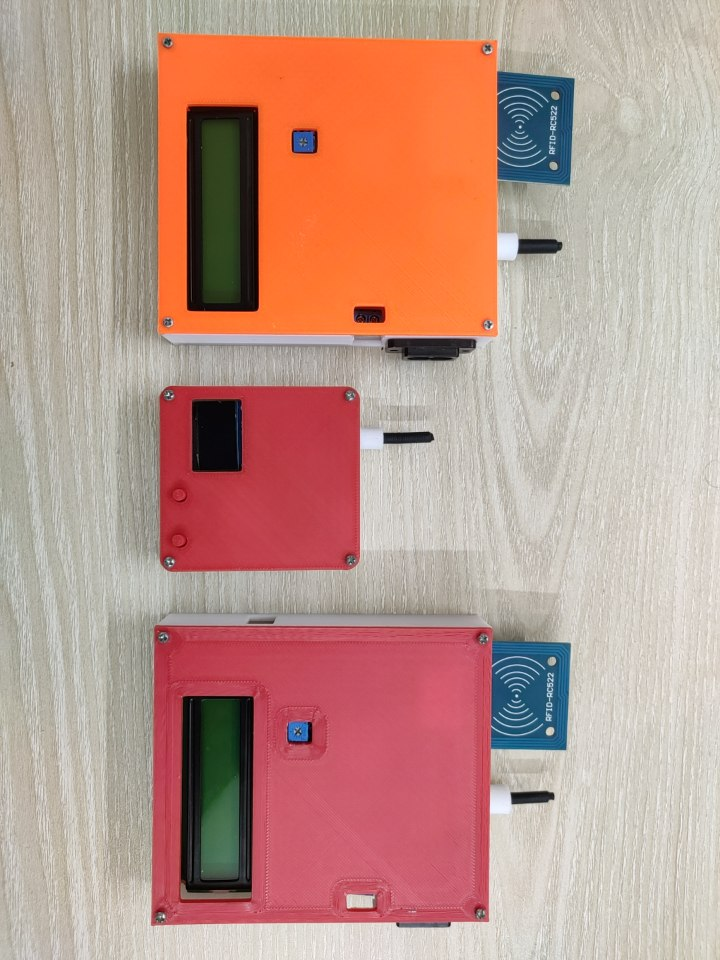

# LoRa Based EV Charging System



A decentralized EV charging communication system built using **LoRa**, **ESP32**, RFID authentication, and custom embedded interfaces.
The project is designed for remote EV charging stations where broadband internet or cellular connectivity is unavailable.

Using a long-range LoRa network, charging stations can communicate with a central IoT gateway for authentication, monitoring, and charging management.

---

# ⚡ Project Overview

In rural or remote areas, deploying EV charging infrastructure can be difficult due to unreliable internet connectivity.
This project solves that problem by creating a **LoRa-based IoT communication system** for EV charging stations.

The system enables:

* RFID-based user authentication
* LoRa communication between charging nodes
* Charging session management
* Remote monitoring
* Embedded display interface
* Long-range offline IoT gateway communication

---

# ✨ Features

## 📡 LoRa IoT Communication

* Long-range wireless communication
* No broadband dependency
* Suitable for remote charging stations

---

## 🔐 RFID Authentication

Users can authenticate charging sessions using RFID cards.

---

## ⚡ Charging Session Control

* Charging timer
* User access control
* Session monitoring
* Charge duration tracking

---

## 🖥 Embedded Display Interface

The charging units include display systems for:

* Charging status
* Authentication status
* Session information
* System notifications

---

## 🌐 Central LoRa Gateway

A central hub collects data from multiple charging stations and acts as an IoT gateway.

---

## 🔋 Off-Grid Ready

The system can be deployed in:

* Rural charging stations
* Remote highways
* Disaster recovery zones
* Solar-powered charging systems

---

# 🛠 Hardware Used

## Charging Node

* ESP32
* LoRa Module
* RFID Reader (RC522)
* LCD/OLED Display
* Push Buttons
* Relay Control
* Power Management System

---

## Gateway Node

* ESP32
* LoRa Module
* IoT Interface

---

# 💻 Software Components

| File                           | Description                        |
| ------------------------------ | ---------------------------------- |
| `LoRa_Hub.ino`                 | Central LoRa gateway               |
| `LoRa_RFID_Sender.ino`         | RFID-based charging request sender |
| `rfid.ino`                     | RFID authentication logic          |
| `charge_time.ino`              | Charging session timer             |
| `display.ino`                  | Display interface                  |
| `display(1).ino`               | Additional display firmware        |
| `http.ino`                     | IoT communication handling         |
| `push.ino`                     | Data transmission functions        |
| `get_val.ino` / `getValue.ino` | Sensor and status retrieval        |
| `bitmap.h`                     | Display graphics and animations    |

---

# 🖼 Project Prototype

## Physical Prototype


The system prototype includes:

* Multiple EV charging terminal units
* RFID authentication interface
* Embedded displays
* LoRa antennas
* 3D printed enclosures

---

# 🔐 RFID Authentication System

Users authenticate using RFID cards before charging begins.

The authentication system allows:

* Authorized access
* User identification
* Session tracking
* Charging control

---

# 📡 LoRa Communication Architecture

```text id="pk7k2k"
EV CHARGING NODE ---> LoRa ---> CENTRAL HUB ---> IoT SERVER
```

The LoRa network allows charging stations to communicate even in areas without internet infrastructure.

---

# 🖥 Display System

The embedded displays provide real-time information including:

* User authentication
* Charging progress
* System state
* Connection status

Custom bitmap animations and display assets are stored in `bitmap.h`. 

---

# ⚡ Charging Workflow

```text id="71okph"
1. User taps RFID card
2. Authentication request sent via LoRa
3. Gateway validates request
4. Charging session begins
5. Timer tracks charging duration
6. Session data transmitted to gateway
```

---

# 🚀 How To Run

## 1️⃣ Upload Firmware

Upload the required `.ino` files to each ESP32 device using:

* Arduino IDE
* PlatformIO

---

## 2️⃣ Configure LoRa Network

Set:

* Frequency
* Node ID
* Gateway parameters

according to your region and deployment requirements.

---

## 3️⃣ Power Up Devices

Once powered:

* Charging nodes connect to LoRa hub
* RFID system initializes
* Display interface activates
* Charging management begins

---

# 🧠 System Architecture

```text id="d6ks7m"
RFID USER
    ↓
CHARGING NODE
    ↓
LoRa NETWORK
    ↓
CENTRAL HUB
    ↓
IoT BACKEND
```

---

# 📷 Recommended Repository Images

```text id="zjlwm5"
images/
├── lora_ev_charger.jpg
├── charging_node.jpg
├── gateway_node.jpg
├── dashboard_preview.png
├── circuit_diagram.png
└── deployment_demo.jpg
```

---

# 🔮 Future Improvements

* Mobile application support
* LoRaWAN integration
* Remote billing system
* Solar charging integration
* OTA firmware updates
* Battery analytics
* Cloud dashboard
* Multi-user charging management
* Smart grid integration

---

# ⚠ Disclaimer

This project is intended for:

* Educational purposes
* Embedded systems research
* IoT experimentation
* Remote infrastructure prototyping

Ensure compliance with electrical safety regulations before deploying real-world charging systems.

---

# 👨‍💻 Author

Developed by **Fazle Elahi Tonmoy**

Fields of Interest:

* IoT Systems
* Embedded Electronics
* Renewable Energy
* EV Infrastructure
* Long-Range Communication Systems

---

# 📄 License

This project is licensed under the MIT License.

```text id="f82n84"
MIT License © 2026 Fazle Elahi Tonmoy
```
